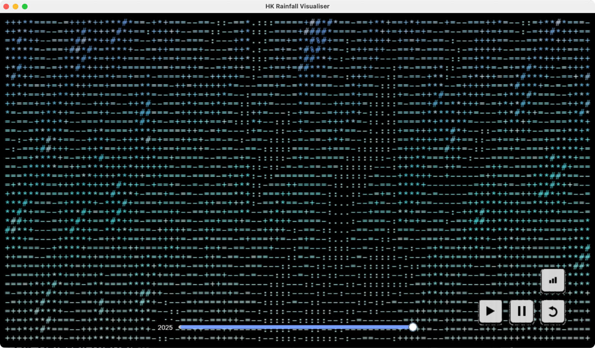

# 🌧️ HK Rainfall Visualiser

**Note:** This repository is a backup. My original account was suspended, so the project is now maintained here. The new repo link is: [https://github.com/Janet0311/HK-rainfall-visualiser-](https://github.com/Janet0311/HK-rainfall-visualiser-)

The HK Rainfall Visualiser is a small desktop application that animates historical Hong Kong monthly rainfall data and lets you open an external rainfall chart viewer.



## 🌐 Live demo (GitHub Pages)

There is an in-browser demo of the visualiser in 
`https://janet0311.github.io/HK-rainfall-visualiser-/`
 (a JS port of the animation) so visitors can view the animation without downloading the app. When Pages is enabled (Branch: `main`, Folder: `/docs`) the demo is published to the repository's Pages URL.

## 🔄 Status
- The main application (`Main.py`) is finished and ready to run.

## ▶️ Run locally
1. Create and activate a Python 3.11+ virtual environment:

```bash
python3 -m venv .venv
source .venv/bin/activate
```

2. Install dependencies:

```bash
pip install -r requirements.txt
```

3. Run the app:

```bash
python Main.py
```

Preview screenshot:


## 📦 Packaging and Downloads
- CI builds for macOS and Windows create packaged executables and publish them as a GitHub Release titled "HK Rainfall Visualiser". Check the repository's Releases page to download the artifacts.
- Each Release contains per-platform files:
  - `HK_Rainfall_Visualiser_<platform>_executable` — the executable you run
  - `HK_Rainfall_Visualiser_<platform>_assets.zip` — runtime assets required next to the executable (image/, data/monthlyElement.xml, font)

## 🗂️ Packaging helpers (archived)
- Packaging scripts and helper files were moved to `packagenotwork/` to keep the repository root focused on runtime code. If you need to rebuild the packages, see that directory.

## 📝 Notes
- The repository excludes Python bytecode caches (`__pycache__`, `*.pyc`). These are not tracked in git.
- If you want the release process changed (e.g., only publish on tags), or a small README added inside the assets zip, tell me and I will update the workflow.

## 🙏 Acknowledgements
- Tooling assistance: GitHub Copilot (code suggestions and editing help)
- Rain sound: "Rain sound" by vem_click — https://pixabay.com/sound-effects/rain-sound-188158/ (used under Pixabay license)
- Rainfall data: Hong Kong Observatory (HKO) monthly rainfall data

## 📬 Contact & credits
See file headers for author credits; license: To be determined.


# HK-rainfall-visualiser-
# HK-rainfall-visualiser-
